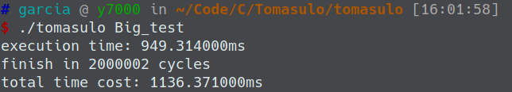
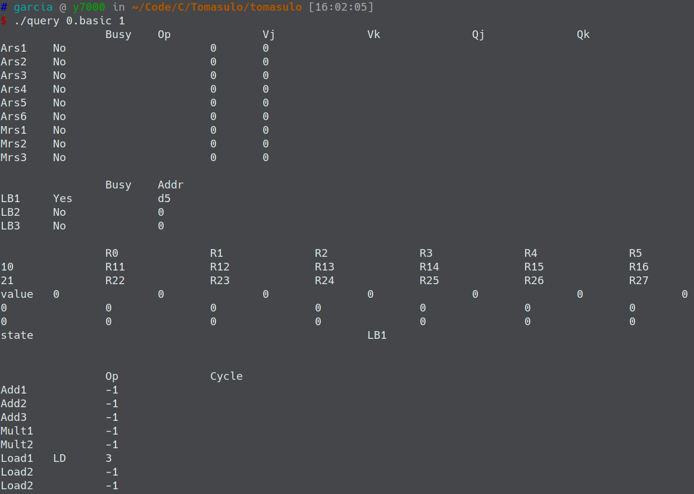
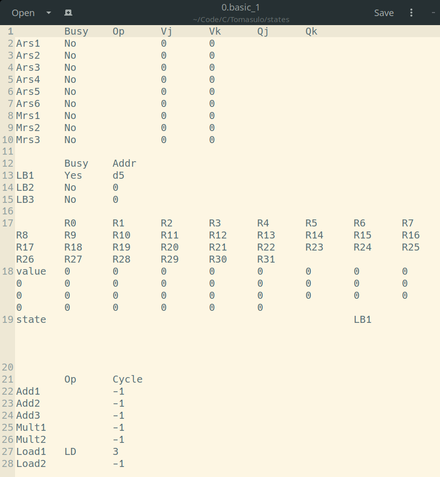
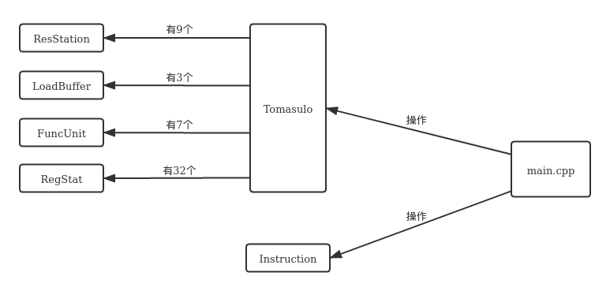
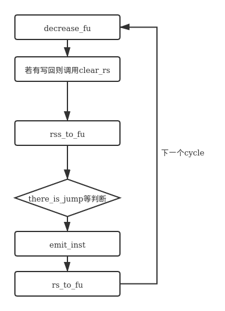

# Tomasulo 实验报告

> 计75  李阳崑  2017011235  li-yk17@mails.tsinghua.edu.cn

[TOC]

## 0 运行方法与说明

### 实验环境

gcc version 9.3.0 (Arch Linux 9.3.0-1)

### 编译

在 `tomasulo/` 文件夹下执行

```shell
g++ main.cpp RegStat.cpp Tomasulo.cpp util.cpp -o tomasulo
```

编译得到可执行文件 `tomasulo` （提交的内容中已包含可执行文件 `tomasulo`）

执行

```shell
g++ query.cpp -o query
```

编译得到可执行文件 `query` （提交的内容中已包含可执行文件 `query`）

### 运行

可执行文件 `tomasulo` 就是Tomasulo算法模拟器，输入以下命令运行：

```shell
./tomasulo [测例名]
```

其中测例名可以取以下12个字符串：

`0.basic`, `1.basic`, `2.basic`, `3.basic`, `4.basic`, `Example`, `Fabo`, `Fact`, `Gcd`, `Mul`, `Big_test`, `my`

代表 `Testcase/` 文件夹下的12个测例文件。

运行模拟器会在命令行输出该测例的算法执行时间、所花cycle数和运行总时间，示例如下：



并且会将运行的log输出在 `Log/` 文件夹下。


可执行文件 `query` 是用来查询模拟器执行过程中任意一个 Cycle 的瞬时状态的，输入以下命令运行：

```shell
./query [测例名] [cycle]
```

测例名不支持`Gcd`, `Mul`, `Big_test`这3个，其他9个都支持。

cycle 表示查询第几个cycle结束时的状态，运行示例如下：



### 关于states

每个测例每个cycle的瞬时状态我用文本文件存在 `states/` 文件夹下，文件名是`测例名_cycle` ，可以直接点开查看：



因为命令行中的制表符`\t`和记事本中的制表符宽度可能不一样，因此有可能出现 `query` 的结果对齐不太好，这个时候可以直接点开`states/`下的文件查看。


## 1 实现功能与实验结果

### 实现功能

- 实现了支持 JUMP 指令的 Tomasulo 算法模拟器，可以输入任何 NEL 测例，记录 log 到 `Log` 文件夹下。
- 支持查询不太大测例（除了`MUL`, `Gcd`, `Big_test`）执行过程中任意一个 Cycle 的执行状态，查询方法见第0部分，也可以直接查看 `states` 文件夹下的文件。

### 实验结果

#### 运行时间汇总

|          | cycle数  | 执行时间/ms | 总时间/ms |
| -------- | -------- | ----------- | --------- |
| 0.basic  | 16       | 2.2         | 2.4       |
| 1.basic  | 60       | 5.7         | 5.8       |
| 2.basic  | 43       | 3.9         | 4.0       |
| 3.basic  | 34       | 4.2         | 4.4       |
| 4.basic  | 64       | 6.4         | 6.5       |
| Example  | 25       | 4.2         | 4.5       |
| Fabo     | 48       | 5.7         | 5.9       |
| Fact     | 278      | 20.1        | 20.2      |
| Gcd      | 63465742 | 18971.2     | 18971.3   |
| Mul      | 5086     | 3.5         | 4.0       |
| Big_test | 2000002  | 954.3       | 1139.8    |

“执行时间”指 Tomasulo 算法开始到结束，包括了打印各个瞬时状态到文件的时间；“总时间”是在执行时间的基础上加上读取指令的时间和打印 log 到文件的时间。

可以看到，除了 `Gcd.nel` 和 `Big_test.nel` 两个测例，其他测例都在几毫秒到几十毫秒内完成；`Big_test.nel`大约用时1秒，`Gcd.nel` 大约用时20秒。

另外这个运行时间和机器本身有很大关系，在我自己的电脑上也会有波动，不过最长也不会超过上面列出时间的2倍。

#### log

统一输出在 `Log` 文件夹下。

#### 任意cycle的瞬时状态

可通过 `query` 程序查询，也可直接查看 `states` 文件夹下内容。


## 2 具体实现

下面从结构和流程两个方面来讲具体实现。

### 结构



**ResStation**：保留站类。定义见ResStation.h。Tomasulo模拟器中含有9个保留站。

**LoadBuffer**：LoadBuffer类。定义见LoadBuffer.h。Tomasulo模拟器中含有3个LoadBuffer。

**FuncUnit**：功能单元类。定义见FuncUnit.h。Tomasulo模拟器中含有7个功能单元。

**RegStat**：寄存器类。定义见RegStat.h。Tomasulo模拟器中含有32个寄存器。

**Instruction**：指令类。定义见Instruction.h。每一条读入的指令都会实例化为一个Instruction对象，记录这条指令的信息。

**Tomasulo**：Tomasulo模拟器。定义见Tomasulo.h。其内部含的成员变量有：9个保留站，3个LoadBuffer，7个功能单元，32个寄存器，和1个指向Instruction数组的指针，代表源源不断地输入模拟器的指令流。其内部含的函数有：

```c
int clear_rs(int rsPos);  // 清空保留站和LoadBuffer
bool rs_to_fu(int rsPos, int cycle);  // 试图将保留站中的一条指令送进功能单元
int rss_to_fu(int cycle);  // 将保留站中能送进功能单元的指令全部送进功能单元
bool there_is_jump();  // 判断是否有未返回的JUMP指令

void decrease_fu(int *pc, bool *flag, int cycle);  // 进入一个cycle, 减FU中的值
bool emit_inst(int *pc, bool *flag, int cycle);  // 试图发射一条指令
```

上面4个函数为下面2个函数所调用，因此提供给main.cpp的接口仅最下面的2个函数。

**main.cpp**是主逻辑，**util.cpp**提供了一些方便打印log和states的函数。


### 流程

每个周期内做事情的流程如下：

1. 将功能单元内所有指令的剩余周期数减一。从0减到-1的，将其写回。写回需要清空功能单元和保留站中对应的位置。若写回的指令是JUMP，还需要改变pc；若不是JUMP，则还需要判断是否改变目的寄存器的值和状态。
2. 指令的写回使得保留站中的其它指令可能就绪，因此调用 `rss_to_fu` 函数，将保留站中能送进功能单元的指令全部送进功能单元。送的顺序遵循实验文档中给出的说明：按照ready的顺序送，同时ready的指令按照被发射的顺序送。
3. 试图发射一条指令。在发射之前，需要检测程序是否执行结束，是不是所有指令已经发射完毕，是否有未返回的JUMP。这些都没问题后，将pc所指的指令发射进保留站。发射之后，还需要检查这条指令是否ready，若是，则调用 `rs_to_fu` 函数，试图将其送进功能单元。

以上三个阶段的事情通过 Tomasulo 类的6个成员函数完成，其流程大致为：



上图表示的是一个cycle内各函数被调用的时间顺序，并不代表6者是并列关系。事实上，其它4个函数是被`decrease_fu`和`emit_inst`所调用的，外层只需要调用`decrease_fu`和`emit_inst`两个函数即可。详细代码见Tomasulo.cpp。


## 3 与记分牌算法的差异性

Tomasulo相比记分牌，最大的差别在于解决了WAW和WAR冲突，前者在指令发射阶段解决，后者在指令写回阶段解决。

因此设计一个简单的每句都有WAW冲突的测例`my.nel`：

```assembly
ADD,R0,R1,R2
ADD,R0,R3,R4
ADD,R0,R5,R6
ADD,R0,R7,R8
ADD,R0,R9,R10
```

这个测例5条指令都要向R0里写，但都没有读R0，因此存在4个WAW冲突，不存在RAW（真冲突）。

运行Tomasulo得到log：

```
1 4 5
2 5 6
3 6 7
4 8 9
5 9 10
```

可以看到WAW完全不影响指令的发射，每条指令都紧跟上一条发射。后两条指令从发射到执行完毕经过了4个周期，这是因为ADD功能单元的数量只有3个，受到了功能单元个数的限制。一共只需10个周期就可执行完毕。

但如果采用记分牌算法，对于这个测例，假设ADD功能单元的数量还是3个，因为issue阶段发射的条件是 $\mathrm{not\ busy\ (FU)\ and\ not\ result(D)}$ ，上一条指令要写R0时下一条就不能发射，因此各条指令发射、执行完毕、写回的周期应该是：

```
1 4 5
5 8 9
9 12 13
13 16 17
17 20 21
```

一共耗时21个周期，比Tomasulo慢了一倍多。而且在这种情况下，因为WAW的缘故，3个功能单元只被占用了1个，造成了资源的浪费。


## 4 总结

与cache模拟器可以几乎完全面向对象编程相比，Tomasulo比较面向过程，较难在写之前就对整个模拟器的架构有一个清晰的规划，很多地方也是边写边改。调本次试过程中收获的一个tip是：

- 善用函数的返回值。如 `rss_to_fu` 函数，其功能是“将RS和LB中能送进FU的指令都送进FU”，我将其返回值定为“送了多少条指令进FU”，在调试时就可以利用这个信息。再如 `rs_to_fu` 函数，其功能是“试图将RS或LB中的一条指令送进FU”，我将其返回值定为“是否成功送入”，那么外层函数在循环调用 `rs_to_fu` 时，就可以直接将这个函数作为判断条件，代码和逻辑都简洁了很多。


本次实验让我更加熟悉了Tomasulo算法，增强了自己的动手能力。非常感谢老师助教的辛勤付出、辛苦答疑！